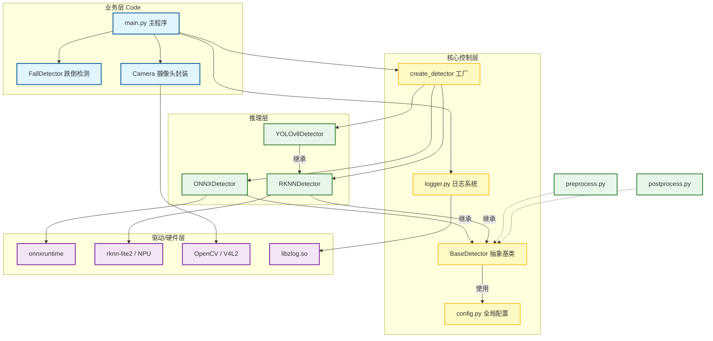

# 项目架构与流程图

## 1. 系统架构图 (System Architecture)

该项目采用分层架构设计，实现了 **业务逻辑**、**推理引擎**、**底层驱动** 的解耦。



---

## 2. 检测数据流向图 (Data Flow)

展示一帧图像从采集到输出的完整生命周期。

```mermaid
flowchart TD
    %% 节点样式
    style Start fill:#222,color:#fff,stroke:#fff
    style End fill:#222,color:#fff,stroke:#fff

    Start([开始]) --> Input{输入源?}
    
    %% 输入处理
    Input --Camera--> Cap[Camera: 多线程采集]
    Input --Image--> Read[cv2.imread]
    
    Cap --> RawImg[原始图像 HxW BGR]
    Read --> RawImg

    %% 预处理
    subgraph Preprocess [预处理 preprocess.py]
        direction TB
        RawImg --> Letterbox[Letterbox: 等比缩放+黑边]
        Letterbox --> Color[BGR -> RGB]
        Color --> InputTensor[640x640 uint8 数据]
    end

    %% 推理
    subgraph Inference [模型推理 detector.py]
        direction TB
        InputTensor --> Format{模型格式?}
        Format --ONNX--> Trans[Transpose NCHW + Norm]
        Trans --> RunONNX[onnxruntime 推理]
        
        Format --RKNN--> RunRKNN[NPU 零拷贝推理]
        
        RunONNX --> Outputs[模型输出 Outputs]
        RunRKNN --> Outputs
    end

    %% 后处理
    subgraph Postprocess [后处理 postprocess.py]
        direction TB
        Outputs --> DFL[DFL 积分: 坐标解码]
        DFL --> Filter[阈值过滤: Conf > 0.25]
        Filter --> NMS[NMS 非极大抑制: IoU > 0.45]
        NMS --> Boxes640[640尺度 检测框]
    end

    %% 结果映射
    subgraph Restore [坐标还原]
        Boxes640 --> Map[restore_coords: (x-pad)/scale]
        Map --> FinalBoxes[原图坐标 检测框]
    end

    %% 业务逻辑
    FinalBoxes --> Draw[OpenCV 绘图 / 业务报警]
    Draw --> Show[cv2.imshow / imwrite]
    Show --> End([结束 / 下一帧])
```

---

## 3. 核心模块说明

- **Main**: 负责调度，不知道具体模型是 ONNX 还是 RKNN。
- **Factory**: 负责"生产"检测器，屏蔽创建细节。
- **BaseDetector**: 定义标准，保证所有检测器有统一的 `detect()` 方法。
- **Pre/Post Process**: 独立的纯函数，方便复用和测试（不依赖类）。
- **Logger**: 策略模式，自动适配 PC (logging) 和板端 (zlog)。
